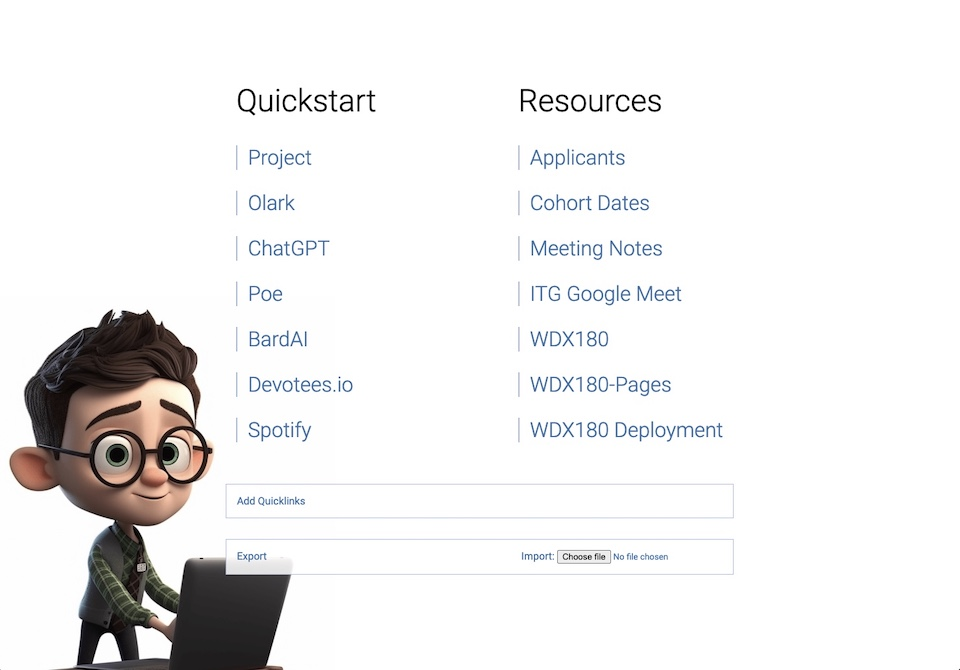
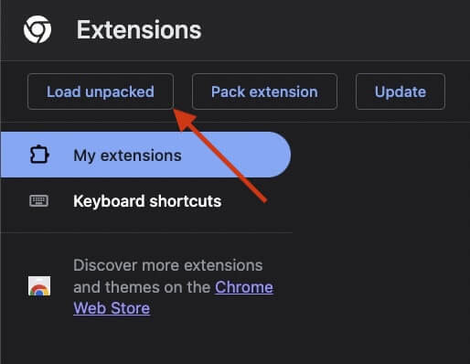

**IMPORANT NOTICE:** This extension is still in `beta`. We'd love your feedback, so feel free to give this extension a shot.

## Installation

1. [Download](https://github.com/in-tech-gration/Chrome.New.Tab.Extension/archive/refs/heads/main.zip) and unzip the repo
2. On Chrome, go to `Extensions > Manage Extensions`
3. Click on `Load Unpacked` and select the downloaded folder 

## TODO

- ~~Add Quickstart tasks~~
- ~~Add Export/Import option~~
- Confirmation on Save
- Re-order Tasks
- Export/Import tasks
- Add Todo List
- Inform for unsaved tasks
- Inform when a resources is deleted but not saved
- Add Dark/Light Theme toggler
- Automatically remove from saved links the ones that have empty label/url values
- On updates, inform to take a backup
- Validate non-https URLs passed as options
- Add custom styling for entries (color, bgcolor, font-size bold, fa icon, etc.)
- Test the ability to add quicklinks to commands like, Clear History, etc.

